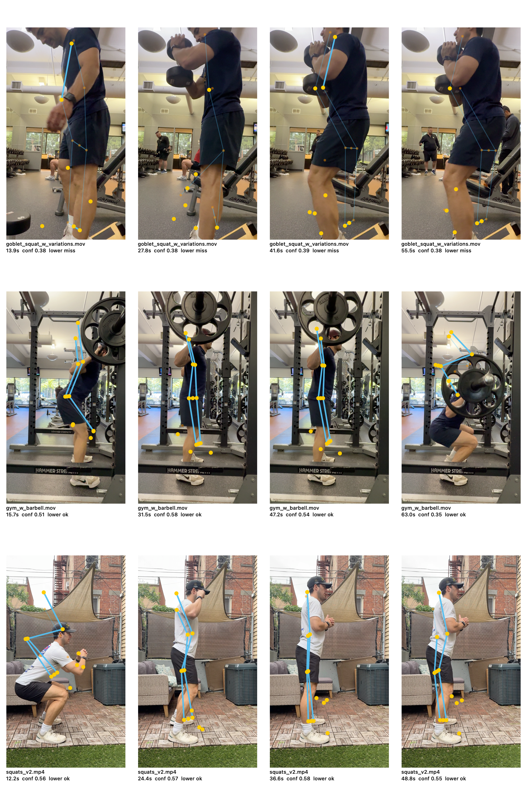

# Apple Vision Smoke Test - 2026-05-24

## Inputs

| Clip | Exercise Context | Duration | Resolution |
|---|---:|---:|---:|
| `squats_v2.mp4` | bodyweight squat | 61.0s | 720x1280 |
| `gym_w_barbell.mov` | in-gym barbell squat | 78.7s | 2160x3840 |
| `goblet_squat_w_variations.mov` | goblet squat variations | 69.4s | 2160x3840 |

## Method

- Engine: Apple Vision `VNDetectHumanBodyPoseRequest`.
- Sample rate: 10 FPS.
- Generated frame cap: 1080px max dimension.
- Confidence threshold for metric gates: 0.30.
- Output JSON: `apple_vision_smoke_results.json`.
- Visual overlay sheet: `apple_vision_contact_sheet.png`.

This is a smoke test, not the final engine bakeoff. The goal is to find obvious blockers and variant-specific failure modes.

## Summary Metrics

| Clip | Frames | Pose Hit Rate | Any-Side Lower Body Complete | Both-Sides Lower Body Complete | Avg Frame Confidence | Longest Pose Miss |
|---|---:|---:|---:|---:|---:|---:|
| `squats_v2.mp4` | 610 | 96.9% | 96.1% | 14.4% | 0.565 | 1.9s |
| `gym_w_barbell.mov` | 787 | 90.9% | 90.5% | 74.3% | 0.518 | 1.6s |
| `goblet_squat_w_variations.mov` | 694 | 81.4% | 9.1% | 5.9% | 0.406 | 5.4s |

## Visual Inspection Notes

### `gym_w_barbell.mov`

Promising. Apple Vision keeps a mostly coherent side-view skeleton through standing and bottom positions. The bar and plates sometimes interfere with head/upper-body confidence, but lower-body tracking is usable in the inspected frames. This is the strongest early evidence that Apple Vision may be viable for side-view barbell squat.

### `squats_v2.mp4`

Mostly usable. Lower-body tracking is available in most sampled frames. Some foot/ankle points drift and the off-side leg is unreliable, but any-side hip/knee/ankle completeness is high enough for a side-view squat analyzer prototype.

### `goblet_squat_w_variations.mov`

Problematic. Apple Vision often detects a person, but lower-body completeness collapses. The visual sheet shows the torso/arm/dumbbell region pulling attention away from stable hip/knee/ankle tracking, and many lower-body joints are either missing or too low-confidence. This should be treated as a known Apple Vision risk for goblet variants until MediaPipe is tested.

## Early Product/Technical Implications

- Side-view barbell squat remains the right v1 anchor.
- For Apple Vision, v1 scoring should be based on the most reliable visible side, not both sides.
- Goblet squat should not be promoted to v1 clean-rep scoring until MediaPipe and/or heuristics improve lower-body completeness.
- The bakeoff must include variant-specific lower-body completeness, not only generic pose-hit rate.
- The app should expose low-confidence labeling because "pose found" is not the same as "squat analyzable."

## Next Step

Run the same three-clip smoke test with MediaPipe Pose Landmarker behind the same normalized schema, then compare lower-body completeness, jitter, and overlay stability. Do not choose an engine from Apple Vision alone.
