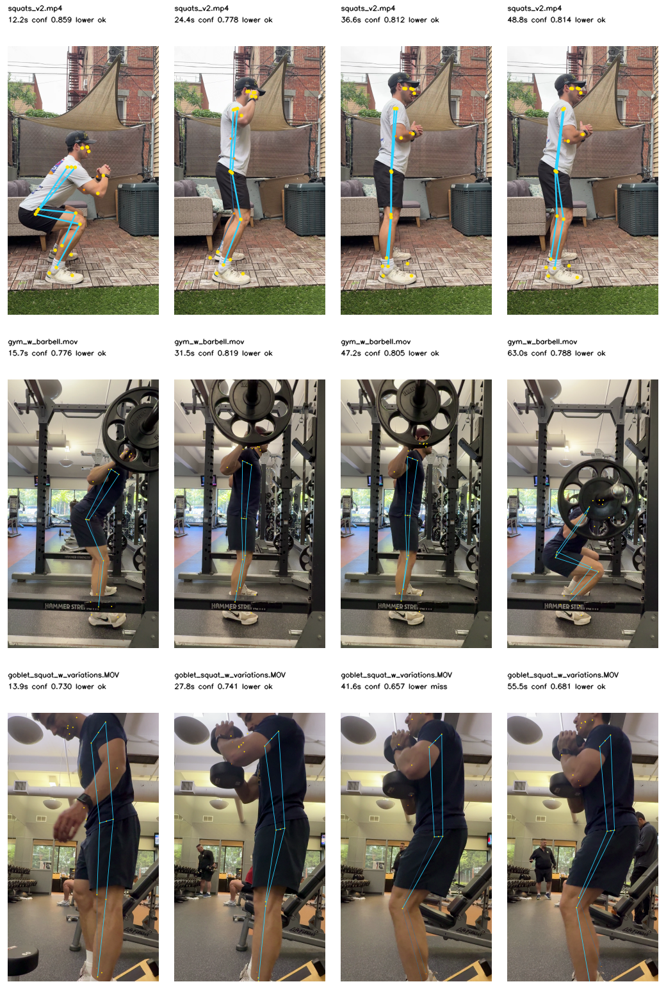

# MediaPipe Smoke Test - 2026-05-24

## Inputs

| Clip | Exercise Context | Duration | Resolution |
|---|---:|---:|---:|
| `squats_v2.mp4` | bodyweight squat | 61.0s | 720x1280 |
| `gym_w_barbell.mov` | in-gym barbell squat | 78.7s | 2160x3840 |
| `goblet_squat_w_variations.MOV` | goblet squat variations | 69.4s | 2160x3840 |

## Method

- Engine: MediaPipe Pose Landmarker full model.
- Model: `/private/tmp/mediapipe_models/pose_landmarker_full.task`.
- Official model source: `https://storage.googleapis.com/mediapipe-models/pose_landmarker/pose_landmarker_full/float16/latest/pose_landmarker_full.task`.
- Sample rate: 10 FPS.
- Generated frame cap: 1080px max dimension.
- Confidence threshold for metric gates: 0.30.
- Runner: `scripts/mediapipe_smoke.py`.
- Output JSON: `mediapipe_smoke_results.json`.
- Visual overlay sheet: `mediapipe_contact_sheet.png`.

The runner applies OpenCV video orientation metadata before inference and rendering. This is required for the `.mov` clips, which are stored landscape but displayed portrait.

## Summary Metrics

| Clip | Frames | Pose Hit Rate | Any-Side Lower Body Complete | Both-Sides Lower Body Complete | Avg Frame Confidence | Longest Pose Miss |
|---|---:|---:|---:|---:|---:|---:|
| `squats_v2.mp4` | 610 | 99.0% | 96.2% | 92.5% | 0.817 | 0.3s |
| `gym_w_barbell.mov` | 787 | 97.3% | 91.6% | 73.7% | 0.764 | 0.5s |
| `goblet_squat_w_variations.MOV` | 694 | 96.3% | 77.8% | 8.4% | 0.669 | 0.5s |

## Visual Inspection Notes

### `squats_v2.mp4`

Strong. MediaPipe gives high confidence and stable visible-side lower-body tracking. It also tracks both legs much more completely than Apple Vision on this clip.

### `gym_w_barbell.mov`

Strong enough for the barbell side-view v1. MediaPipe preserves lower-body structure at the bottom and standing positions. The rack and plates still create occlusion, but the model keeps a plausible lower-body chain in the inspected frames.

### `goblet_squat_w_variations.MOV`

Materially better than Apple Vision. MediaPipe still struggles with both-sides completeness because this is a close, partially occluded side-view goblet setup, but any-side lower-body completeness is high enough to keep goblet variants on the roadmap rather than dismissing them.

## Apple Vision vs MediaPipe Snapshot

| Clip | Apple Any-Side Lower | MediaPipe Any-Side Lower | Read |
|---|---:|---:|---|
| `squats_v2.mp4` | 96.1% | 96.2% | Tie on minimum usability; MediaPipe has stronger confidence and both-side completeness. |
| `gym_w_barbell.mov` | 90.5% | 91.6% | Near tie on lower-body completeness; MediaPipe confidence is higher, Apple runtime is faster. |
| `goblet_squat_w_variations` | 9.1% | 77.8% | MediaPipe clearly wins this variant. |

## Early Product/Technical Implications

- MediaPipe is the current quality leader for broader lower-body coverage.
- Apple Vision remains viable for a narrow barbell/bodyweight side-view v1 and is faster in the current local smoke runners.
- If the product wants goblet squat soon, MediaPipe deserves priority.
- The next decision should include on-device iPhone runtime, because Python runner speed is not the same as iOS Tasks runtime.

## Next Step

Install CocoaPods and add `MediaPipeTasksVision` to the iOS `PoseBakeoff` target, then implement a native `MediaPipePoseEstimator` behind `PoseEstimator` using the same normalized landmark schema.
